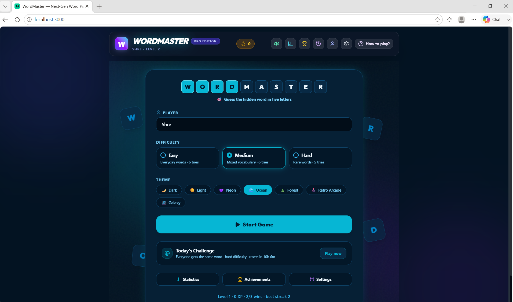
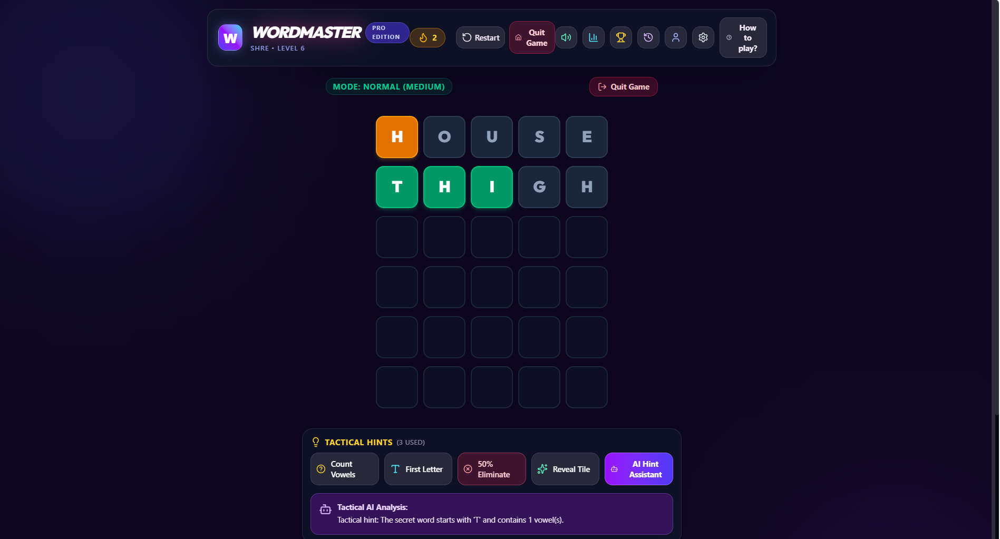
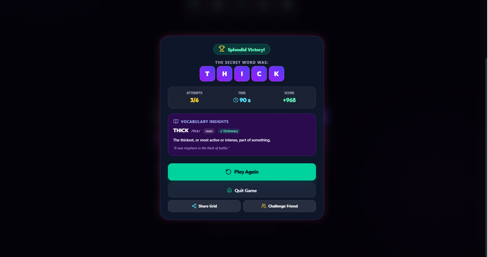
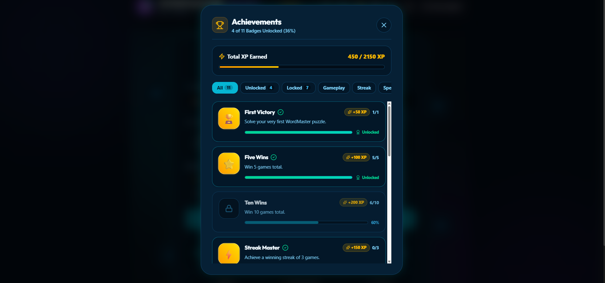
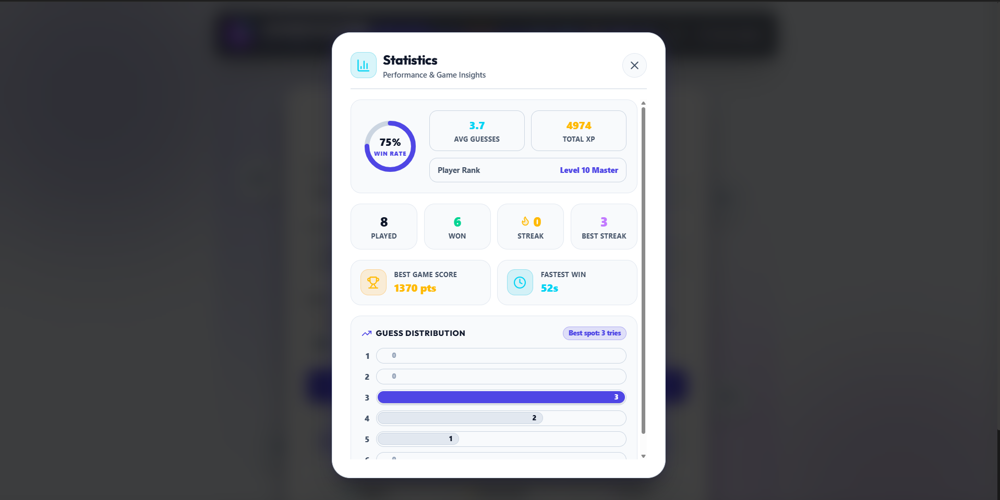

# WordMaster 🧠✨

A fully responsive, modern, production-quality Wordle-inspired web application with **Server-Authoritative Game State**, **SQLite Database Storage**, **AI Hint Assistant**, **Vocabulary Insights**, **Statistics Analytics**, **Daily Challenge Mode**, **Custom Themes**, and **Sound Synthesis**.

---

## 📸 Screenshots

<table>
  <tr>
    <td align="center" width="50%">
      
      <br/><sub><b>Setup Screen</b> — difficulty, themes, and daily challenge</sub>
    </td>
    <td align="center" width="50%">
      
      <br/><sub><b>Gameplay</b> — live board with Tactical AI hint assistant</sub>
    </td>
  </tr>
  <tr>
    <td align="center" width="50%">
      
      <br/><sub><b>Victory & Vocabulary Insights</b> — real dictionary-verified definitions</sub>
    </td>
    <td align="center" width="50%">
      
      <br/><sub><b>Achievements</b> — unlockable badges and XP progress</sub>
    </td>
  </tr>
  <tr>
    <td align="center" colspan="2">
      
      <br/><sub><b>Statistics</b> — win rate, streaks, and guess distribution</sub>
    </td>
  </tr>
</table>

---

## 🌟 Key Features

- **🎮 Core Gameplay**:
  - Server-authoritative game state — target words are kept strictly on the server and never exposed in network payloads until game-over.
  - 6 attempts (or 4 in Sudden Death mode) to solve hidden words with real-time green, yellow, and gray tile feedback.
  - Precise duplicate letter evaluation logic executed server-side.
  - Interactive virtual QWERTY keyboard and physical keyboard support.

- **🎯 Difficulty Levels**:
  - **Easy**: 4-letter words
  - **Medium**: 5-letter words
  - **Hard**: 6-letter words
  - **Expert**: Random 4–8 letter words

- **⏱️ Game Modes**:
  - **Classic Mode**: Relaxation mode with no timer.
  - **Timed Mode**: 60-second total countdown.
  - **Sudden Death Mode**: 30-second rapid rush with 4 maximum attempts.
  - **Daily Challenge Mode**: Deterministic daily puzzle identical for all players worldwide.

- **🧠 AI Hint Assistant & Vocabulary Mode**:
  - **Tactical AI Assistant**: Server-side Gemini AI (`gemini-3.6-flash`) evaluates previous guesses and delivers strategic advice without spoiling the secret word.
  - **Server-Side Hint Engine**: Progressive hints (`vowels`, `firstLetter`, `revealTile`, `eliminateKeys`) validated and tracked on the server.
  - **Vocabulary Mode**: After every game, view the target word's phonetic pronunciation, part of speech, concise definition, example sentence, and etymology fun facts.

- **📊 Statistics & Global Leaderboard**:
  - Server-backed persistent leaderboard powered by SQLite with WAL mode and case-insensitive nickname indexing.
  - Track Games Played, Win %, Current Streak, Longest Streak, Best Score, and Average Attempt Count.
  - Visual Guess Distribution Chart.
  - Full Guess History with one-click **CSV Export**.

- **🏆 Badges & Achievements**:
  - Unlockable achievement cards (First Victory, Mind Reader 1st try win, Speed Demon, Word Genius, Word Centurion, etc.).

- **🎨 Themes & Accessibility**:
  - 8 Glassmorphism Themes: *Purple Sunset*, *Midnight Dark*, *Clean Light*, *Cyberpunk 2077*, *Neon Glow*, *Ocean Depth*, *Enchanted Forest*, *Retro Arcade*.
  - Accessibility toggles: Colorblind indicator symbols, High-contrast palette, and Web Audio API synthesizer.

- **🔥 Friend Challenge & Emoji Sharing**:
  - Copy Wordle-style emoji result grid (`🟩🟨⬜`).
  - Generate custom encoded challenge links so friends can compete on the exact same word.

---

## 🏗️ Architecture & Security Model

```
┌───────────────────────────┐                ┌───────────────────────────┐
│     React Frontend        │                │    Express REST Server    │
│  (src/App.tsx & UI)       │                │  (server.ts / gameEngine) │
└─────────────┬─────────────┘                └─────────────┬─────────────┘
              │                                            │
              │  1. POST /api/game/new                    │
              ├───────────────────────────────────────────►│ (Creates game session,
              │  ◄────────────────────────────────────────┤  selects target word,
              │     { gameId, wordLength, maxAttempts }    │  saves session to SQLite)
              │                                            │
              │  2. POST /api/game/:id/guess               │
              ├───────────────────────────────────────────►│ (Validates guess in
              │  ◄────────────────────────────────────────┤  dictionary, evaluates tile
              │     { valid, statuses, isWin, isGameOver }│  colors, updates DB state)
              │                                            │
              │  3. POST /api/game/:id/hint                │
              ├───────────────────────────────────────────►│ (Executes vowel count,
              │  ◄────────────────────────────────────────┤  tile reveal, key elimination)
              │     { success, data }                      │
              │                                            │
              │  4. POST /api/ai-hint                      │
              ├───────────────────────────────────────────►│ (Server fetches target word,
              │  ◄────────────────────────────────────────┤  calls Gemini AI safely)
              │     { hint, isOfflineFallback }            │
              │                                            │
              │  5. POST /api/score                        │
              ├───────────────────────────────────────────►│ (Validates score & name with
              │  ◄────────────────────────────────────────┤  Zod, upserts into SQLite)
              │     { success, entry }                     │
              └────────────────────────────────────────────┴───────────────────────────┘
```

- **Target Word Secrecy**: The target word is stored in SQLite on the server and is **never** sent to the client until the game is over (`isGameOver = true`).
- **Input Validation**: All requests are strictly parsed using Zod schemas (`NewGameSchema`, `GuessSchema`, `GameHintSchema`, `LeaderboardEntrySchema`).
- **Data Persistence**: Active game sessions and global leaderboards persist across server restarts in an embedded SQLite database (`data/wordmaster.db`) with Write-Ahead Logging (WAL) mode enabled for concurrent safety.
- **Rate Limiting & Security**: Express rate limiting protects API endpoints. Helmet headers enforce security policies in production deployments.

### API Endpoint Reference

| Endpoint | Method | Description |
| :--- | :--- | :--- |
| `/api/game/new` | `POST` | Initialize a new server-side game session |
| `/api/game/:id/guess` | `POST` | Submit guess for evaluation against secret target word |
| `/api/game/:id/hint` | `POST` | Execute server-side game hint (`vowels`, `firstLetter`, `revealTile`, `eliminateKeys`) |
| `/api/ai-hint` | `POST` | Request AI tactical advice powered by Gemini 3.6 Flash |
| `/api/word-definition` | `POST` | Fetch dictionary & etymology details for vocabulary view |
| `/api/leaderboard` | `GET` | Retrieve top 10 player scores from SQLite DB |
| `/api/score` | `POST` | Validate and submit player score to global leaderboard |
| `/api/validate-word` | `POST` | Check if a word exists in the dictionary |
| `/api/health` / `/api/ready` | `GET` | Server liveness & readiness monitoring probes |

---

## 🛠️ Tech Stack

- **Frontend**: React 19, TypeScript, Tailwind CSS, Lucide Icons, Canvas-Confetti
- **Backend / API**: Node.js, Express, tsx, esbuild, Helmet, CORS, Express-Rate-Limit, Zod
- **Database / Storage**: SQLite (`better-sqlite3`) with WAL mode & indexing
- **AI Integration**: `@google/genai` (Gemini 3.6 Flash)
- **Audio**: Web Audio API Synthesizer
- **Testing**: Vitest (`npm run test`)

---

## 📁 Folder Structure

```
├── server.ts               # Express server entry point & security middlewares
├── server/
│   ├── db.ts               # SQLite database client & Leaderboard schema
│   ├── gameEngine.ts       # Server-authoritative game state & mechanics
│   ├── gameEngine.test.ts  # Vitest unit test suite for game engine & DB
│   ├── logger.ts           # Structured logging utility
│   └── words.ts            # Dictionary datasets (4, 5, 6, expert words)
├── src/
│   ├── components/         # Reusable React components
│   │   ├── Board.tsx       # Wordle grid & tile rows
│   │   ├── Header.tsx      # Top bar with streak & navigation
│   │   ├── HomeScreen.tsx  # Mode & difficulty launcher
│   │   ├── Keyboard.tsx    # QWERTY interactive keyboard
│   │   ├── Tile.tsx        # Animated glassmorphism letter tile
│   │   ├── HintPanel.tsx   # Hints & AI Assistant
│   │   ├── WinLoseModal.tsx# Game over modal & Vocabulary Mode
│   │   ├── StatsModal.tsx  # Analytics dashboard
│   │   ├── AchievementsModal.tsx
│   │   ├── HistoryModal.tsx # Guess history & CSV export
│   │   ├── SettingsModal.tsx
│   │   └── ProfileModal.tsx
│   ├── utils/
│   │   ├── achievements.ts # Achievement rules engine
│   │   ├── audio.ts        # Web Audio API sound synthesizer
│   │   └── storage.ts      # LocalStorage persistence wrapper for user options
│   ├── types.ts            # Global TypeScript definitions
│   ├── App.tsx             # Main application orchestrator
│   └── main.tsx            # Entry point
├── data/
│   └── wordmaster.db       # Persistent SQLite database file
└── package.json
```

---

## 🚀 How to Run Locally

1. **Install Dependencies**:
   ```bash
   npm install
   ```

2. **Set Environment Variable** (Optional for AI Hint Assistant):
   ```bash
   GEMINI_API_KEY="your-gemini-api-key"
   ```

3. **Start Development Server**:
   ```bash
   npm run dev
   ```
   Open `http://localhost:3000` in your browser.

4. **Run Unit Tests**:
   ```bash
   npm run test
   ```

5. **Production Build & Start**:
   ```bash
   npm run build
   npm start
   ```

---

## 📜 License

MIT License © 2026 WordMaster Team.
